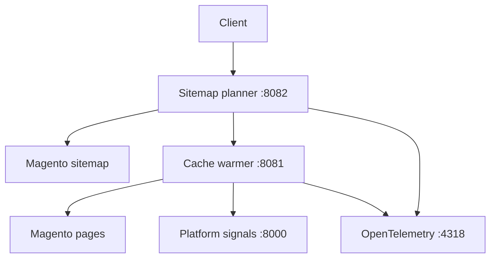

# Operational Intelligence

Operational Intelligence selects important URLs from a sitemap, warms them
sequentially, and stops before the next request when platform signals indicate
that continuing would be unsafe. Every HTTP journey is traced with
OpenTelemetry.

## What the system currently does

The implemented journey is synchronous:

1. `sitemap-planner` downloads a sitemap URL set.
2. It transforms each sitemap entry into a planning record with cache, latency,
   priority, and tag metadata.
3. It filters and ranks those records using configuration supplied in the
   request.
4. It sends one configured batch to `cache-warmer`. The current safety bound is
   10 URLs per batch.
5. `cache-warmer` requests each URL sequentially.
6. After the complete batch, `cache-warmer` asks `platform-signals` for CPU,
   memory, disk, Redis, and Varnish signals.
7. It returns a gate decision indicating whether another batch may start.

There is no background worker or persistent job queue in this version. The
caller waits for the complete selection and warming journey to finish.

See [the end-to-end flow](docs/end-to-end-flow.md) for the runnable development
journey, the deliverable to inspect after every step, and the durable worker
flow that remains to be implemented.



## Service responsibilities

| Service | Responsibility | Does not do |
| --- | --- | --- |
| `sitemap-planner` | Fetch, tag, filter, rank, and select sitemap URLs | Measure actual page latency or decide platform safety |
| `cache-warmer` | Fetch selected URLs sequentially and record results | Discover or prioritise URLs |
| `platform-signals` | Report current platform signals | Decide whether warming should continue |
| Jaeger/OTLP | Receive and display traces | Control the request journey |

`targetResponseTimeMs` is a planning target, not a measured result. The actual
duration is recorded by cache-warmer as `durationMs`.

## Local prerequisites

- Node.js 20 or later and npm;
- Python 3.11 or Docker for Platform Signals;
- Docker for the documented Jaeger and Platform Signals commands;
- the external Docker network `mageos_network` when Platform Signals uses its
  supplied Compose file;
- the local Caddy root certificate when testing
  `mageos-docker.magsite.co.uk`.

Confirm the expected ports are available:

```bash
ss -ltnp | grep -E ':(8000|8081|8082|4318|16686)\b'
```

Before startup, no output is expected for ports `8000`, `8081`, and `8082`.

## First-time setup

Install dependencies and create local environment files:

```bash
cp platform-signals/.env.sample platform-signals/.env
cp cache-warmer/.env.sample cache-warmer/.env
cp sitemap-planner/.env.sample sitemap-planner/.env

(cd cache-warmer && npm ci)
(cd sitemap-planner && npm ci)
```

For the local Magento hostname, add it to both allowlists:

```env
# cache-warmer/.env
CACHE_WARMER_ALLOWED_HOSTS=mageosuk.reactedge.net,mageos-docker.magsite.co.uk

# sitemap-planner/.env
SITEMAP_ALLOWED_HOSTS=mageosuk.reactedge.net,mageos-docker.magsite.co.uk
```

Check that Node can validate the local Magento certificate:

```bash
NODE_EXTRA_CA_CERTS=/usr/local/share/ca-certificates/caddy-root.crt \
node -e "fetch('https://mageos-docker.magsite.co.uk/media/sitemap/uk.xml').then(r => console.log(r.status)).catch(e => console.error(e.cause ?? e))"
```

The expected output is `200`. Do not use `NODE_TLS_REJECT_UNAUTHORIZED=0`;
that disables TLS verification rather than establishing trust.

## Start the complete local system

Use a separate terminal for each long-running process.

### 1. Start Jaeger

```bash
docker run --detach --rm \
  --name reactedge-jaeger \
  --env COLLECTOR_OTLP_ENABLED=true \
  --publish 16686:16686 \
  --publish 4317:4317 \
  --publish 4318:4318 \
  jaegertracing/all-in-one:latest
```

Verify the UI is reachable at <http://localhost:16686>.

### 2. Start Platform Signals

```bash
cd platform-signals
docker compose up --build --force-recreate
```

Verify its contract:

```bash
curl --fail http://127.0.0.1:8000/status
```

The JSON response must contain `cpu`, `memory`, `disk`, `redis`, and `varnish`
under `signals`. A disconnected Redis or Varnish service is a valid reported
  signal, but the post-batch gate will prevent another batch from starting.

### 3. Start cache-warmer

```bash
cd cache-warmer
NODE_EXTRA_CA_CERTS=/usr/local/share/ca-certificates/caddy-root.crt npm run dev
```

There is intentionally no console log for each request; inspect the HTTP
response and Jaeger trace instead.

### 4. Start sitemap-planner

```bash
cd sitemap-planner
NODE_EXTRA_CA_CERTS=/usr/local/share/ca-certificates/caddy-root.crt npm run dev
```

Verify its health route:

```bash
curl --fail http://localhost:8082/sitemap-planner/status
```

Expected response:

```json
{"status":"ok"}
```

## End-to-end verification

Use the development sitemap that belongs to the local Magento environment:

```bash
curl -i --request POST \
  --header 'Content-Type: application/json' \
  --data '{
    "sitemapUrl": "https://mageos-docker.magsite.co.uk/media/sitemap/uk.xml",
    "selection": {
      "requiredTags": ["must_be_cached"],
      "maximumTargetResponseTimeMs": 200,
      "minimumPriority": 5,
      "limit": 2
    }
  }' \
  http://localhost:8082/sitemap-planner/dev-warm
```

Use `-i` rather than `--fail` during diagnosis so an error response body is
not hidden. A working response has HTTP `200`, `selected` between 1 and 2, an
`entries` array containing only the selected planning records, and a
`cacheWarmer` object containing measured results.

Cache-warmer processes every URL in the submitted batch, then returns
`status: "completed"`. The separate `gate.allowed` value indicates whether a
future batch may start. A false gate is a successful safety decision, not an
HTTP failure; inspect `gate.reasons` for the explanation.

## Verify observability

Open <http://localhost:16686> and check both services.

### `reactedge-sitemap-planner`

The trace should contain:

```text
sitemap_planner.request
└── sitemap_planner.dev_warm
    ├── sitemap_planner.fetch_sitemap
    ├── sitemap_planner.transform
    ├── sitemap_planner.select
    └── sitemap_planner.delegate_cache_warmer
```

### `reactedge-cache-warmer`

The trace should contain:

- `cache_warmer.request`;
- `cache_warmer.test_urls`;
- one `cache_warmer.load_url` per URL actually requested;
- one `cache_warmer.platform_status` after the batch;
- one `cache_warmer.next_batch_gate` after the batch.

The two services currently export separate traces. Cross-service trace-context
propagation is not yet implemented, so correlate them by time and URL.

## Troubleshooting

| Symptom | Meaning | Check |
| --- | --- | --- |
| Planner returns `{"error":"fetch failed"}` | It could not establish the sitemap HTTP/TLS connection | Restart planner with `NODE_EXTRA_CA_CERTS`; run the standalone Node fetch check |
| Planner says the sitemap host is not allowed | Host is absent from the planner allowlist | `SITEMAP_ALLOWED_HOSTS` in `sitemap-planner/.env` |
| Planner says cache-warmer returned an HTTP error | Sitemap selection succeeded; delegation failed | Call `POST :8081/cache-warmer/test-urls` directly and inspect its body |
| Cache-warmer rejects a target host | Host is absent from its independent allowlist | `CACHE_WARMER_ALLOWED_HOSTS` in `cache-warmer/.env` |
| Cache-warmer returns `gate.allowed: false` | The safety policy has prevented another batch | `gate.reasons`, Platform Signals response, and Jaeger spans |
| Connection refused on `8081` or `8082` | The corresponding Node service is not running | `ss -ltnp` and the service terminal |
| No traces appear | Collector is unavailable or the wrong service/time range is selected | Jaeger container, port `4318`, `OTEL_HOST`, service selector |

## Current limitations

- only sitemap URL sets are supported; sitemap indexes are not expanded;
- planning metadata currently marks every parsed URL as `must_be_cached` with a
  `200 ms` target; this is an initial uniform policy to validate the pipeline,
  not the final URL-classification model;
- sitemap `<priority>` is expected in the protocol range `0.0–1.0` and mapped
  to internal priority `1–5`; when absent, priority comes from URL path depth;
- this endpoint currently sends one batch per synchronous request;
- 10 URLs is the current explicit maximum batch size, inherited from the
  initial safety requirement rather than a technical HTTP limitation;
- jobs are not queued, persisted, retried, or resumed;
- cache verification is not yet a separate pass;
- dependency failures are currently returned as `502` with limited diagnostic
  detail.

## Generate another observable server

The root MCP server exposes `create_server`, which creates a new Express
service from `packages/server-template` with the same request and route
OpenTelemetry middleware.

```bash
cd mcp
npm install
REACTEDGE_ROOT="$(git rev-parse --show-toplevel)" npm start
```

To use the MCP Inspector from the repository root:

```bash
npx @modelcontextprotocol/inspector npx tsx mcp/server.ts
```
